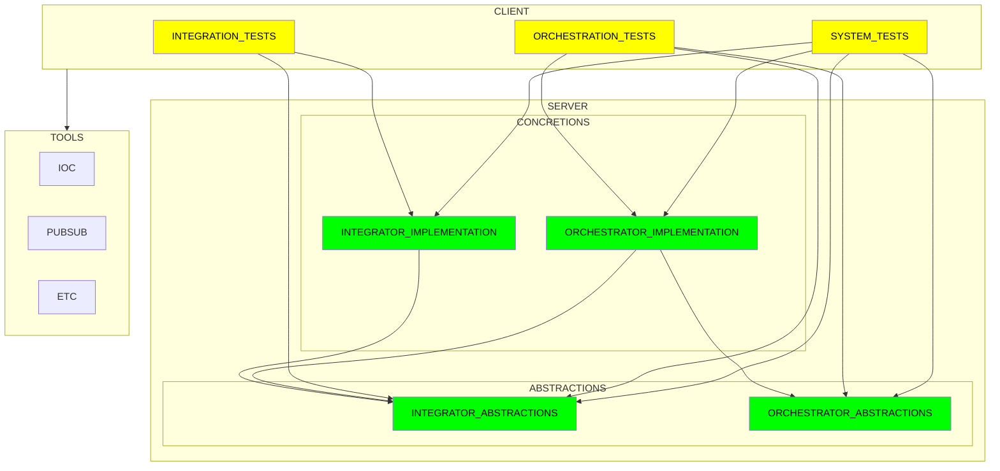

# Demo 010 - Test Helper

## Shows

The test helper package helps you mock services so you can isoloate your services and test them independently.

## Example

```csharp

```

## Dependency Management


Your interface contracts should serve as a boundary that encapsulates implementation changes. The better your interface design, the more it will encapsulate change.

While not required, I encourage Applinate users to separate interfaces and implementation.

Here’s why.

If well-designed, your service contracts should change at different rates from your implementation.

You contain implementation changes when you separate your abstractions and implementations into separate assemblies. And service updates don’t blow up throughout your application. This makes your code more rot-resistant. You can replace parts of your implementation independently. And as a bonus, this practice makes managing, revising, and extending your services more manageable.

This structural convention ensures anyone working on the code follows the SOLID inversion of control (IOC) principle because they can only consume services through abstractions.

This also forces your tests to be non-imperative, facilitating implementation changes in your service and encouraging engineers to focus testing on behavior verification, not implementation, improving your code base's rot resistance.

----

Dependency points to note in this demo.
* All implementation assemblies have internal classes accessed solely through their abstractions, eliminating the risk of depending on implementation details.
* Your test project behaves like a client. It references all orchestrator and integrator implementations and tools (e.g., IOC framework) while only referencing the orchestrator contracts (the consumer SDK for the orchestrator).
* Your abstraction assemblies have no dependencies outside the framework.
* Your implementation assemblies have a reference to their contracts (the abstractions).
* Your orchestration implementation references the integration abstractions (but not the integration implementation).

### Demo.Integrate.Abstractions.010
- none

### Demo.Integrate.Implementation.010
- Demo.Integrate.Abstractions.010

### Demo.Orchestrate.Abstractions.010
- none

### Demo.Orchestrate.Implementation.010
- Demo.Orchestrate.Abstractions.010
- Demo.Integrate.Abstractions.010

### Tests.010
- Demo.Integrate.Abstractions.010
- Demo.Integrate.Implementation.010
- Demo.Orchestrate.Abstractions.010
- Demo.Orchestrate.Implementation.010
- Demo.Orchestrate.Abstractions.010
- Demo.Integrate.Abstractions.010



